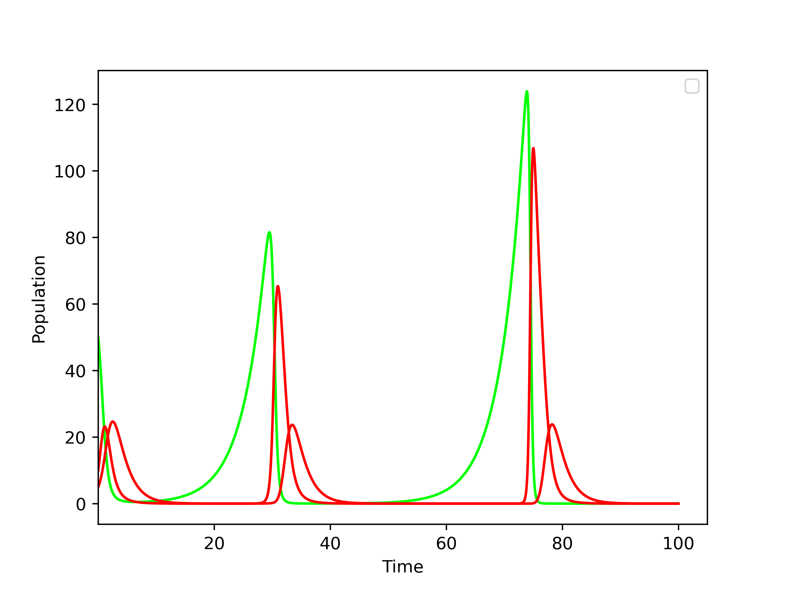
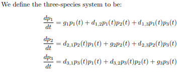

# Introduction

This is program is used to simulate N-species population dynamics using a generalized version of the Lotka-Volterra formula for N-species. References to the paper with this formula included at the bottom. The Lotka-Volterra formulas are solved numerically using Euler's method.

# Getting Started [Wiki](https://github.com/amp7368/N-Lotka-Volterra/wiki)

The [Wiki](https://github.com/amp7368/N-Lotka-Volterra/wiki) has more information about how to run the program.

# Model

A simulation has 3 main components: `initial populations`, `growth rates`, and `coefficients`.

## Growth Rate

The growth rates are the natural rate of growth/decline of a species if there were no interactions between any other species. A positive value can be thought of as an herbivore that's eating plentiful vegetation or vegetation that's photosynthesizing. A negative value would mean that the species would naturally die off without interactions and require another species to maintain it's own population.

## Coefficients

The coefficients represent the strength of uni-directional connections between species. A negative coefficient in row P_1 and column P_2 means that P_1's population is declining from a higher presence of P_2, which is like a predator-prey relationship, or a parasitic relationship. A positive coefficient, would mean that P_2's population is increasing from the presence of P_2

In the table below, --, -, 0, +, ++ means very negative, negative, zero, positive, and very positive coefficients respectively. Some rows have been committed for brevity.

| P_1 | P_2 | Example                                                                                                                         |
| --- | --- | ------------------------------------------------------------------------------------------------------------------------------- |
| --  | --  | Two species compete heavily                                                                                                     |
| --  | 0   | P_2 kills off P_1 to avoid food competition if they consume the same food source. P_2 only gains from the new abundance of food |
| --  | ++  | P_2 is a parasite/predator to prey P_1                                                                                          |
| 0   | 0   | No interaction between species                                                                                                  |
| 0   | +   | Slight commensalism relationship                                                                                                |
| +   | ++  | P_2 gains a great advantage from P_1, while P_1 gains slightly                                                                  |
| ++  | ++  | Symbiotic relationship                                                                                                          |

# Example

This is the example supplied by [[References#Extending the Lotka-Volterra Equations]]

#### Initial Populations

The initial populations of the species. Since decimals are allowed, these values only have meaning relative to each other.

| P_1 | P_2 | P_3 |
| --- | --- | --- |
| 50  | 10  | 5   |

#### Growth Rates

P_1 eats vegetation and will grow out of control if P_2 or P_3 did not keep this P_1's population down. P_2 and P_3 decline and will naturally die out.

| G_1  | G_2  | G_3  |
| ---- | ---- | ---- |
| 0.25 | -0.5 | -0.5 |

### Coefficients

Diagonal is always 0. Growth rates are really what go in the diagnol but it's easier to visualize with growth rates in a separate table.

-   P_2 is predator to P_1 shown by -0.04 and 0.04.
-   P_3 is predator to P_1 shown by -0.04 and 0.02
-   P_3 is predator to P_1 shown by -0.02 and 0.04

| Coeff | P_1  | P_2   | P_3   |
| ----- | ---- | ----- | ----- |
| P_1   | 0    | -0.04 | -0.04 |
| P_2   | 0.04 | 0     | -0.02 |
| P_3   | 0.02 | 0.04  | 0     |

#### How to use coefficients in the simulation code

myself = P_3
neighbor1 = P_1
neighbor2 = P_2
coefficients[my_self][neighbor1] == graph.edge(myself,neighbor1)["weight"]

coefficients[my_self][neighbor1] = 0.02
coefficients[my_self][neighbor2] = 0.04

next_population[myself] = (growth[myself] \* population[myself]) +
(coefficients[my_self][neighbor1] \* population[neighbor1] \* population[myself]) +
(coefficients[my_self][neighbor2] \* population[neighbor2] \* population[myself])

out = np.sum(coefficients, axis=1) # 0.02 + 0.04 + 0.00

### Pred-2 Prey-1

# Implementation

## Euler's method

Configuration of Euler's method is found in settings of the loaded `src/load_parameters.py`

-   euler_step  
    the time step to take
-   max_time  
    The max duration of the simulation
-   iterations  
    Derived from euler_step and max_time: `iterations = max_time / euler_step`

## Formula

Formula from Lalith (pg 7).

# References

#### Extending the Lotka-Volterra Equations

Devireddy, Lalith. “Extending the Lotka-Volterra Equations.” (2016). https://sites.math.washington.edu/~morrow/336_16/2016papers/lalith.pdf

#### Food-web structure and network theory: The role of connectance and size

https://www.ncbi.nlm.nih.gov/pmc/articles/PMC130560/
