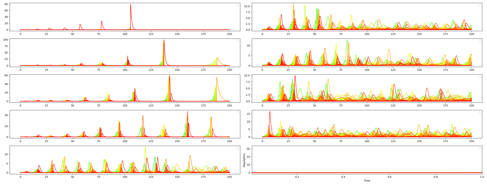

# Introduction

This is program is used to simulate N-species population dynamics using a generalized version of the Lotka-Volterra formula for N-species. References to the paper with this formula included at the bottom. The Lotka-Volterra formulas are solved numerically using Euler's method.

# Getting Started

#### Dependencies

```
# Tested on python 3.12.3
pip install -r requirements.txt
```

OR

```
conda env create -f environment.yml
```

#### Running

```
python pred_2_prey_1.py
python random_simulation.py
python vary_independence.py
```

# Model

A simulation has 3 main components: `initial populations`, `growth rates`, and `coefficients`.

## Growth Rate

The growth rates are the natural rate of growth/decline of a species if there were no interactions between any other species. A positive value can be thought of as an herbivore that's eating plentiful vegetation or vegetation that's photosynthesizing. A negative value would mean that the species would naturally die off without interactions and require another species to maintain it's own population.

## Coefficients

The coefficients represent the strength of uni-directional connections between species. A negative coefficient in row P_1 and column P_2 means that P_1's population is declining from a higher presence of P_2, which is like a predator-prey relationship, or a parasitic relationship. A positive coefficient, would mean that P_2's population is increasing from the presence of P_2

In the table below, --, -, 0, +, ++ means very negative, negative, zero, positive, and very positive coefficients respectively. Some rows have been committed for brevity.

| P_1 | P_2 | Example                                                                                                                         |
| --- | --- | ------------------------------------------------------------------------------------------------------------------------------- |
| --  | --  | Two species compete heavily                                                                                                     |
| --  | 0   | P_2 kills off P_1 to avoid food competition if they consume the same food source. P_2 only gains from the new abundance of food |
| --  | ++  | P_2 is a parasite/predator to prey P_1                                                                                          |
| 0   | 0   | No interaction between species                                                                                                  |
| 0   | +   | Slight commensalism relationship                                                                                                |
| +   | ++  | P_2 gains a great advantage from P_1, while P_1 gains slightly                                                                  |
| ++  | ++  | Symbiotic relationship                                                                                                          |

# Example

This is the example supplied by [[N-Lotka-Volterra#References#Extending the Lotka-Volterra Equations]]

#### Initial Populations

The initial populations of the species. Since decimals are allowed, these values only have meaning relative to each other.

| P_1 | P_2 | P_3 |
| --- | --- | --- |
| 50  | 10  | 5   |

#### Growth Rates

P_1 eats vegetation and will grow out of control if P_2 or P_3 did not keep this P_1's population down. P_2 and P_3 decline and will naturally die out.

| G_1  | G_2  | G_3  |
| ---- | ---- | ---- |
| 0.25 | -0.5 | -0.5 |

### Coefficients

Diagonal is always 0. Growth rates are really what go in the diagnol but it's easier to visualize with growth rates in a separate table.

-   P_2 is predator to P_1 shown by -0.04 and 0.04.
-   P_3 is predator to P_1 shown by -0.04 and 0.02
-   P_3 is predator to P_1 shown by -0.02 and 0.04

| Coeff | P_1  | P_2   | P_3   |
| ----- | ---- | ----- | ----- |
| P_1   | 0    | -0.04 | -0.04 |
| P_2   | 0.04 | 0     | -0.02 |
| P_3   | 0.02 | 0.04  | 0     |

### Pred-2 Prey-1


# Implementation

## Euler's method

Configuration of Euler's method is in `simulate.py` using optional SimulationOptions.

-   euler_step  
    the time step to take
-   max_time  
    The max duration of the simulation
-   iterations  
    Derived from euler_step and max_time: `iterations = max_time / euler_step`

## Formula


Formula from Lalith (pg 7).

## Color-scale

Represents the growth rate with green being the greatest growth rate, yellow being zero growth rate, and red being the most negative growth rate

# Files

### Common/Utils

-   simulate.py
    Utility to simulate a run from t=0 to t=max_time of the
    **Configuration** in method call:
    `euler_step`, `max_time`, `extinct_if_below`
-   write_simulation.py
    functions for writing simulations files such as figure image, parameter files, and the population-data.csv
-   util.py

### Initial simulations

These files were the initial models with 3 species

-   pred_1_prey_2.py
-   pred_2_prey_1.py
-   pred_1_mid_1_prey1-a.py
-   pred_1_mid_1_prey1-b.py

### Random

Explained in next section

-   random_simulation.py
-   vary_independence.py

# Random generation

The `random_simulation()` function in random_simulation.py generates a semi-random model based on input factors and internal distributions. `remove_connections` will randomly remove connections in an uniform distribution across all connections.
Prey/predator is determined by randomly selecting a coefficient at each x,y above the diagnol of the matrix. Then reflecting it across the diaganol, and making that value negative and.... todo

-   species_count: number of species to generate
-   indepence_ratio: What percentage of connections should be removed
-   coeff_mean: The strength of connections between species
-   coeff_stddev: The standard deviation of the coefficients

# Independence variance

vary_indepence.py

-   Simulates 10 models with different indepence_ratios.
-   Will take a somewhat long time to run as-is. decrease `species_count=200` in the random_simulation() method call to change how many species are in each of the 10 simulations
-   The produced figure has 10 graphs with the following independence ratios displayed in this orientation with 50% independence at the top right graph.

```
0%  independence | 50%  independence
10% independence | 60%  independence
20% independence | 70%  independence
30% independence | 80%  independence
40% independence | 100% independence
```

Survival rates at 100 species

```
| 30% survived | 60% survived |
| 49% survived | 61% survived |
| 57% survived | 64% survived |
| 56% survived | 62% survived |
| 74% survived | 49% survived |
```

# Discussion

With 0% standard deviation in growth and coeff I find that highly connected networks are more likely to die out. This is because there is random variation in the connections, and when everything is connected, there is no random variations and the extremely regular coefficeints are expressed in extremely periodic spikes of population. Increasing the randomness in growth and coeff makes the graph more stable by removing some periodicity. Discussion Example 1 & 2 demonstrate how some randomness introduces stability in most networks

I originally was thinking that highly connected networks somehow became dependent on the other species since these networks maintain most of their population, but when a few species die out, then everything collapses. However, now I believe that the 50% independence graphs only perform better because there's more random variation introduced into the model, which improves stability.

## Discussion Example 1

vary_independence.py

```
Parameters:
random_simulation(
	species_count=200,
	independence_ratio=0.0 through 1.0
	coeff_mean=0.2,
	growth_stddev=0.0,
	coeff_prey_stddev=0.0,
	coeff_predator_stddev=0.0
)
```

```
Surviving Populations:
| 0% survived | 66% survived |
| 4% survived | 66% survived |
| 4% survived | 60% survived |
| 32% survived | 57% survived |
| 65% survived | 55% survived |
```



## Discussion Example 2

vary_independence.py

```
Parameters:
random_simulation(
	species_count=200,
	independence_ratio=0.0 through 1.0
	coeff_mean=0.2,
	growth_stddev=0.001,
	coeff_prey_stddev=0.5,
	coeff_predator_stddev=0.15
)
```

```
Surviving Populations:
| 48% survived | 30% survived |
| 50% survived | 42% survived |
| 46% survived | 13% survived |
| 47% survived |  2% survived |
| 52% survived |  6% survived |
```


# Future Work

-   I really want to understand how network structure impacts the stability of the simulation. Currently connections are in a random uniform distribution.
-   Accelerate the computation with a GPU and multithreading.
-   Maybe make a website and API to run simulations when the client inputs different parameters
-   Add JSON save files so parameters can be loaded easier
-   Understand how random initial conditions influence future state and stability
-   Try different growth rate and coefficient generation methods
-   Hovering over lines can select and view the trail of a single species
-   Try to simulate using explicitly spatial population distributions

# References

#### Extending the Lotka-Volterra Equations

Devireddy, Lalith. “Extending the Lotka-Volterra Equations.” (2016). https://sites.math.washington.edu/~morrow/336_16/2016papers/lalith.pdf
